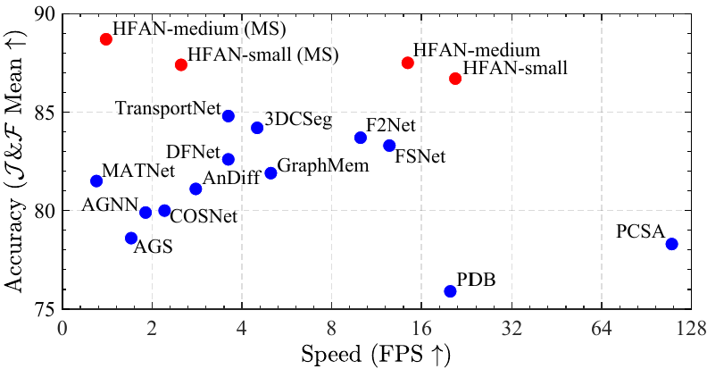

#  HFAN: Hierarchical Feature Alignment Network for Unsupervised Video Object Segmentation (ECCV 2022)

## Note: Google Drive subscription has expired, and we have migrated models to Baidu Drive.

## Introduction
> This work has been accepted to ECCV 2022, and we will update the camera-ready version soon.<br>

> [Gensheng Pei](https://scholar.google.com/citations?user=ihU_QpsAAAAJ&hl=en), Yazhou Yao*, Guo-Sen Xie*, Fumin Shen, Zhenmin Tang, Jinhui Tang. "Hierarchical Feature Alignment Network for Unsupervised Video Object Segmentation", European Conference on Computer Vision (ECCV), 2022.<br>


## Performance vs. Speed


Figure 1: Performance of HFAN-Small and HFAN-Medium on DAVIS-16.

## Overview
This repository is the official PyTorch implementation of the anonymous paper:
> **Hierarchical Feature Alignment Network for Unsupervised Video Object Segmentation**<br>
> **FAM** relies on sharing primary objects in images across modalities to align appearance and motion features  to address the mismatch of primary object positions between video frames and their corresponding optical flows. <br>
> **FAT** constructs a feature adaptation weight to automatically enhance cross-modal features to tackle the modal mismatch problem between aligned feature maps.<br>


Figure 2: The framework of HFAN.

## Dependencies
We use MMSegmentation to implement our model, and CUDA 10.1 to run our experiments.
Please refer to the guidelines in [MMSegmentation v0.11.0](https://github.com/open-mmlab/mmsegmentation/tree/v0.11.0).

To simplify the reproduction steps, we only need to install
```bash
pip install torch==1.7.1 torchvision==0.8.2
pip install mmcv-full==1.3.8 -f https://download.openmmlab.com/mmcv/dist/cu101/torch1.7.0/index.html
pip install opencv-python
```

## Dataset Preparation
1. Download the DAVIS dataset from [DAVIS website](https://data.vision.ee.ethz.ch/csergi/share/davis/DAVIS-2017-trainval-480p.zip).
2. Download the YouTube-VOS dataset from [YouTube-VOS website](https://youtube-vos.org/dataset/).
3. To quickly reproduce the proposed method, we upload the processed data to Baidu Drive ([DAVIS](https://pan.baidu.com/s/1bVFkq82DBy7Oyi82KeBhZw?pwd=2tns) and [YouTube-VOS](https://pan.baidu.com/s/1pET4ZRvSFld6yPDuL2AHAA?pwd=luss)). 
4. Please ensure the datasets are organized as following format.
```
|DAVIS2SEG
|--frame
|--flow
|--mask

|YouTube2SEG
|--frame
|--flow
|--mask
```


## Training
> **Note that the locations in the code where the paths need to be modified are shown below:**<br>
> `infer.py` in line 35.<br>
> `local_configs/hfan/*.160k.py` in lines 3, 4, 69.<br>
> `local_configs/hfan/*.refine.py` in lines 3, 67, 111.<br>

Download [MiT weights](https://connecthkuhk-my.sharepoint.com/:f:/g/personal/xieenze_connect_hku_hk/EvOn3l1WyM5JpnMQFSEO5b8B7vrHw9kDaJGII-3N9KNhrg?e=cpydzZ) pretrained on ImageNet-1K, and put them in a folder `checkpoint/`.

Train `HFAN-Small` 
```bash
# two gpus training (V100 32G)
# Please set OMP_NUM_THREADS=(1 or Your CPUs) when training with multiple GPUs.
## First
CUDA_VISIBLE_DEVICES=0,1 OMP_NUM_THREADS=16 bash tools/dist_train.sh local_configs/hfan/hfan.small.512x512.160k.py 2 --seed 1208 --deterministic --work-dir hfan-small
## Second
CUDA_VISIBLE_DEVICES=0,1 OMP_NUM_THREADS=16 bash tools/dist_train.sh local_configs/hfan/hfan.small.512x512.refine.py 2 --seed 1208 --deterministic --work-dir hfan-small
```
Train `HFAN-Medium`
```bash
# two gpus training (V100 32G)
## First
CUDA_VISIBLE_DEVICES=0,1 OMP_NUM_THREADS=16 bash tools/dist_train.sh local_configs/hfan/hfan.medium.512x512.160k.py 2 --seed 1208 --deterministic --work-dir hfan-medium
## Second
CUDA_VISIBLE_DEVICES=0,1 OMP_NUM_THREADS=16 bash tools/dist_train.sh local_configs/hfan/hfan.medium.512x512.refine.py 2 --seed 1208 --deterministic --work-dir hfan-medium
```
## Testing
Download [HFAN-Small](https://pan.baidu.com/s/1FFdeziezAaBXbfoaQprZ6g?pwd=8we9), and put it in a folder `checkpoint/`.

Evaluate `HFAN-Small`:
```bash
# single gpu (V100 32G)
python infer.py \
    --config local_configs/hfan/hfan.small.512x512.refine.py \
    --checkpoint checkpoint/HFAN-s-converted.pth \
    --output_dir ./output_path/hfan-small
    
# single gpu (V100 32G) with multi-scale
python infer.py \
    --config local_configs/hfan/hfan.small.512x512.refine.py \
    --checkpoint checkpoint/HFAN-s-converted.pth \
    --output_dir ./output_path/hfan-small-MS --aug-test
```
Download [HFAN-Medium](https://pan.baidu.com/s/1FFdeziezAaBXbfoaQprZ6g?pwd=8we9), and put it in a folder `checkpoint/`.

Evaluate `HFAN-Medium` 
```bash
# single gpu (V100 32G)
python infer.py \
    --config local_configs/hfan/hfan.medium.512x512.refine.py \
    --checkpoint checkpoint/HFAN-m-converted.pth \
    --output_dir ./output_path/hfan-medium
    
# single gpu (V100 32G) with multi-scale
python infer.py \
    --config local_configs/hfan/hfan.medium.512x512.refine.py \
    --checkpoint checkpoint/HFAN-m-converted.pth \
    --output_dir ./output_path/hfan-medium-MS --aug-test
```
## Results

We report the results from the current codebase as follows, which match the performance reported in our original paper.
For unsupervised video object segmentation, the matlab version of evaluation code can be obtained from [DAVIS-EValuation](https://github.com/davisvideochallenge/davis-matlab/tree/davis-2016),
and the multiprocessing python version is available [PyDavis16EvalToolbox](https://github.com/lartpang/PyDavis16EvalToolbox).
The evaluation toolbox for video salient object detection task is available [VSOD](https://github.com/GewelsJI/FSNet/tree/main/eval).

**DAVIS-16, Unsupervised Video Object Segmentation**

| Metrics          | J Mean ↑ | J Recall ↑ | J Decay ↓ | F Mean ↑ | F Recall ↑ | F Decay ↓ | J&F Mean ↑ | FPS ↑ |
| :--------------- | -------: | ---------: | --------: | -------: | ---------: | --------: | ---------: | ----: |
| HFAN-Small  (SS) |     86.2 |       96.7 |       4.6 |     87.1 |       95.5 |       2.3 |       86.7 |  20.8 |
| HFAN-Small  (MS) |     87.1 |       96.8 |       4.8 |     87.7 |       95.3 |       2.5 |       87.4 |  2.5  |
| HFAN-Medium (SS) |     86.8 |       96.1 |       4.3 |     88.2 |       95.3 |       1.1 |       87.5 |  14.4 |
| HFAN-Medium (MS) |     88.0 |       96.2 |       4.5 |     89.3 |       95.4 |       2.0 |       88.7 |  1.4  |

**Long-Videos, Unsupervised Video Object Segmentation**

| Metrics     | J Mean ↑ | J Recall ↑ | J Decay ↓ | F Mean ↑ | F Recall ↑ | F Decay ↓ | J&F Mean ↑ |
| :---------- | -------: | ---------: | --------: | -------: | ---------: | --------: | ---------: |
| HFAN-Small  |     74.9 |       82.5 |      14.8 |     76.1 |       86.0 |      16.0 |       75.5 |
| HFAN-Medium |     80.2 |       91.2 |       9.4 |     83.2 |       96.5 |       7.1 |       81.7 |

**DAVIS-16, Video Salient Object Detection**

| Metrics     | S ↑      | E ↑        | F ↑       | MAE ↓    | 
| :---------- | -------: | ---------: | --------: | -------: |
| HFAN-Small  |    0.934 |      0.983 |     0.929 |    0.009 |
| HFAN-Medium |    0.938 |      0.983 |     0.935 |    0.008 |

## Ablation Studies
To facilitate the ablation study, we decompose the various modules of the model in the codebase.
Download links are provided for each ablation version of the model.

**Impact of Data Input**

```bash
# single gpu (V100 32G)
## Image frame only
python infer.py \
    --config local_configs/hfan/hfan.small.512x512.refine.py \
    --checkpoint checkpoint/im-converted.pth \
    --options model.decode_head.select_method=im \
    --output_dir ./output_path/im
## Optical flow only    
python infer.py \
    --config local_configs/hfan/hfan.small.512x512.refine.py \
    --checkpoint checkpoint/fw-converted.pth \
    --options model.decode_head.select_method=fw \
    --output_dir ./output_path/fw
## Baseline    
python infer.py \
    --config local_configs/hfan/hfan.small.512x512.refine.py \
    --checkpoint checkpoint/baseline-converted.pth \
    --options model.decode_head.select_method=base \
    --output_dir ./output_path/baseline
```

| Input             | J Mean ↑ | ΔJ   | F Mean ↑ | ΔF    |  download |
| :---------------- | -------: | ---: | -------: | ----: | --------: |
| Image frame only  |     79.1 | -3.9 |     79.8 |  -3.5 |     [model](https://pan.baidu.com/s/1FFdeziezAaBXbfoaQprZ6g?pwd=8we9) / [mask](https://pan.baidu.com/s/1WgJNe7T5ABB935KCjI1PoQ?pwd=ey2m) |
| Optical flow only |     77.9 | -5.1 |     76.5 |  -6.8 |     [model](https://pan.baidu.com/s/1FFdeziezAaBXbfoaQprZ6g?pwd=8we9) / [mask](https://pan.baidu.com/s/1WgJNe7T5ABB935KCjI1PoQ?pwd=ey2m) |
| Baseline          |     83.0 |    - |     83.3 |     - |     [model](https://pan.baidu.com/s/1FFdeziezAaBXbfoaQprZ6g?pwd=8we9) / [mask](https://pan.baidu.com/s/1WgJNe7T5ABB935KCjI1PoQ?pwd=ey2m) |

**Efficacy of Crucial Modules**

```bash
# single gpu (V100 32G)
## FAM 
python infer.py \
    --config local_configs/hfan/hfan.small.512x512.refine.py \
    --checkpoint checkpoint/FAM-converted.pth \
    --options model.decode_head.select_method=fam \
    --output_dir ./output_path/FAM
## FAT
python infer.py \
    --config local_configs/hfan/hfan.small.512x512.refine.py \
    --checkpoint checkpoint/FAT-converted.pth \
    --options model.decode_head.select_method=fat \
    --output_dir ./output_path/FAT
## HFAN  
python infer.py \
    --config local_configs/hfan/hfan.small.512x512.refine.py \
    --checkpoint checkpoint/HFAN-s-converted.pth \
    --options model.decode_head.select_method=hfan \
    --output_dir ./output_path/HFAN
```

| Variants          | J Mean ↑ | ΔJ   | F Mean ↑ | ΔF    |  download |
| :---------------- | -------: | ---: | -------: | ----: | --------: |
| Baseline          |     83.0 |    - |     83.3 |     - |     [model](https://pan.baidu.com/s/1FFdeziezAaBXbfoaQprZ6g?pwd=8we9) / [mask](https://pan.baidu.com/s/1WgJNe7T5ABB935KCjI1PoQ?pwd=ey2m)|
| Baseline + FAM    |     85.2 | +2.2 |     85.6 |  +2.3 |     [model](https://pan.baidu.com/s/1FFdeziezAaBXbfoaQprZ6g?pwd=8we9) / [mask](https://pan.baidu.com/s/1WgJNe7T5ABB935KCjI1PoQ?pwd=ey2m) |
| Baseline + FAT    |     85.0 | +2.0 |     86.1 |  +2.8 |     [model](https://pan.baidu.com/s/1FFdeziezAaBXbfoaQprZ6g?pwd=8we9) / [mask](https://pan.baidu.com/s/1WgJNe7T5ABB935KCjI1PoQ?pwd=ey2m) |
| Baseline + HFAN   |     86.2 | +3.2 |     87.1 |  +3.8 |     [model](https://pan.baidu.com/s/1FFdeziezAaBXbfoaQprZ6g?pwd=8we9) / [mask](https://pan.baidu.com/s/1WgJNe7T5ABB935KCjI1PoQ?pwd=ey2m) |

**Efficacy of Backbone**

| Backbone            | J Mean ↑  |  F Mean ↑ |    FPS ↑ |  download |
| :-------------------| --------: | --------: | -------: | --------: |
| MiT-b0 (SS/MS)      | 81.5/83.4 | 80.8/82.3 | 24.0/3.4 |     [model](https://pan.baidu.com/s/1FFdeziezAaBXbfoaQprZ6g?pwd=8we9) / [mask](https://pan.baidu.com/s/1WgJNe7T5ABB935KCjI1PoQ?pwd=ey2m) |
| MiT-b1 (SS/MS)      | 86.2/87.1 | 87.1/87.7 | 20.8/2.5 |     [model](https://pan.baidu.com/s/1FFdeziezAaBXbfoaQprZ6g?pwd=8we9) / [mask](https://pan.baidu.com/s/1WgJNe7T5ABB935KCjI1PoQ?pwd=ey2m) |
| MiT-b2 (SS/MS)      | 86.8/88.0 | 88.2/89.3 | 14.4/1.4 |     [model](https://pan.baidu.com/s/1FFdeziezAaBXbfoaQprZ6g?pwd=8we9) / [mask](https://pan.baidu.com/s/1WgJNe7T5ABB935KCjI1PoQ?pwd=ey2m) |
| MiT-b3 (SS/MS)      | 86.8/88.2 | 88.8/90.0 | 10.6/1.0 |     [model](https://pan.baidu.com/s/1FFdeziezAaBXbfoaQprZ6g?pwd=8we9) / [mask](https://pan.baidu.com/s/1WgJNe7T5ABB935KCjI1PoQ?pwd=ey2m) |
| Swin-Tiny (SS/MS)   | 86.0/87.2 | 87.3/87.9 | 12.8/1.1 |     [model](https://pan.baidu.com/s/1FFdeziezAaBXbfoaQprZ6g?pwd=8we9) / [mask](https://pan.baidu.com/s/1WgJNe7T5ABB935KCjI1PoQ?pwd=ey2m) |
| ResNet-101 (SS/MS)  | 86.7/87.5 | 87.5/88.1 | 12.4/1.3 |     [model](https://pan.baidu.com/s/1FFdeziezAaBXbfoaQprZ6g?pwd=8we9) / [mask](https://pan.baidu.com/s/1WgJNe7T5ABB935KCjI1PoQ?pwd=ey2m) |

## Visualize Ablated Versions
**Feature-level visualization**

**Mask-level visualization**

## Qualitative Results
**Mask-level visualization**


## Citation
If you find this useful in your research, please consider citing:
```bash
@inproceedings{
title={Hierarchical Feature Alignment Network for Unsupervised Video Object Segmentation},
author={Gensheng Pei, Yazhou Yao, Guo-Sen Xie, Fumin Shen, Zhenmin Tang, Jinhui Tang},
booktitle={European Conference on Computer Vision (ECCV)},
year={2022}
}
```
